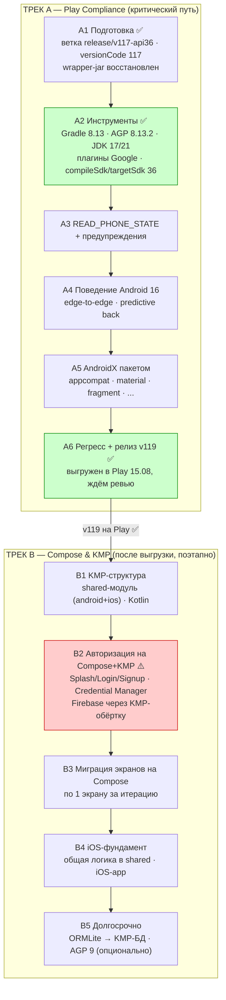
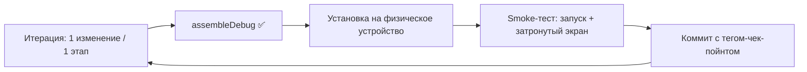
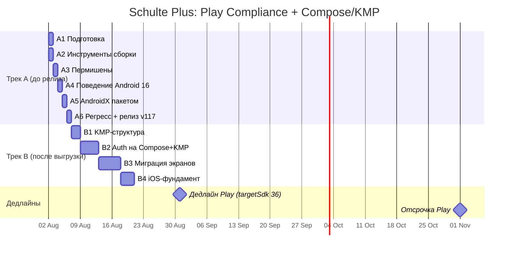

# План обновления Schulte Plus: Play Compliance + миграция на Compose/KMP

> **Дата:** 2026-08-02 (актуализация: **15.08.2026 — трек A завершён, трек B возобновлён**)
> **IDE:** Android Studio **Quail 3 | 2026.1.3** (runtime JDK 25) — поддерживает AGP вплоть до 9.x
> **Статус:** Трек A **A1–A6 ✅** — **v119 выгружен в Play Console (15.08.2026), ждём ревью Google**. Трек B в работе — ветка **`feature/kotlin2`**
> **Версия релиза: 119** (118 — активный релиз на Play; 119 — на ревью в Google)
> **Вход работает** (правильные креды google-services.json; старый firebase-auth 16.0.3 — плановая миграция в B2)
> **Дедлайн Play:** с **31 августа 2026** обновления должны таргетить API 36 (отсрочка — до 01.11.2026)
> **Тестирование:** физическое устройство пользователя, после каждой итерации

## 1. Стратегия: два трека

**Принципы:**

- **(а) Приоритет:** Трек A — минимальный безопасный путь до выгрузки v117. Play не проверяет версии библиотек — только targetSdk, пермишены, конфиденциальность. **Авторизацию в треке A не трогаем**, Firebase — на месте.
- **(б) Работоспособность:** каждая итерация заканчивается чек-пойнтом: `assembleDebug` → установка на устройство → smoke-тест → коммит. Сборка всегда зелёная.
- **(в) Compose & KMP:** всё, что переписывается (авторизация), сразу пишется на Kotlin + Compose Multiplatform в модуле `shared` (android + ios targets) — фундамент для iOS.

## 2. Трек A — минимальный путь до Play

> Цель: выгрузить v117 (versionCode 117, имя `Entada`) с targetSdk 36. **Auth и Firebase в этом треке не обновляются.**

### A1. Подготовка — ✅ сделано 02.08.2026
- Ветка `release/v117-api36` от master
- `versionCode` 116 → **117**
- JDK 21 на WSL ✓ (AGP 8/9 требуют ≥ 17); AS Quail 2026.1.3 (runtime JDK 25)
- 🐛 Найдено: `gradle-wrapper.jar` отсутствовал в репозитории — восстановлен (v7.6.0), закоммитить

### A2. Инструменты сборки — ✅ сделано 02.08.2026, BUILD SUCCESSFUL
**Слияние v118:** с другого компа в ветку влит весь `origin/sssr-space` (7 коммитов: Support-фича, quiz off, стили, гигиена) — это содержимое **активного релиза 118 на Play**, терять нельзя. Конфликты: `versionCode` → **119** (build.gradle + AndroidManifest), `gradle-wrapper.jar` (взят их, новее). Коммиты: `c159410` (тулчейн) + `3203a03` (merge).

**Решение:** вместо AGP 9.2.1 взят **AGP 8.13.2** (связка Gradle 8.13 + AGP 8.13.2, подготовленная пользователем):
- Без сломанного DSL: `applicationVariants` работает, миграция на `androidComponents` не нужна
- compileSdk 36 полностью поддерживается
- Меньше рисков для быстрого релиза; AGP 9 — отложено (трек B5)

| Шаг | Статус |
|---|---|
| Gradle 7.6 → **8.13** (дистрибутива «8.13.2» не существует — 8.13.2 это версия AGP; wrapper обновлён) | ✅ |
| AGP 7.4.2 → **8.13.2** (buildscript + plugins блок) | ✅ (сделано пользователем) |
| JDK: Java **17** compileOptions (AS runtime 25, WSL 21) | ✅ (сделано пользователем) |
| Плагины: google-services **4.5.0**, crashlytics-gradle **3.0.7**, oss-licenses-plugin **0.13.0** | ✅ |
| `compileSdk 34` → **36**, `targetSdk` → **36** (target сделал пользователь) | ✅ |
| `buildFeatures`: buildConfig true, resValues true | ✅ (сделано пользователем) |
| gradle.properties: удалён `suppressUnsupportedCompileSdk=34`; configuration-cache **отключён** (несовместим с `applicationVariants`; включим после миграции на androidComponents) | ✅ |
| Убрать `resolutionStrategy` force kotlin-stdlib 1.8.0 | ⏳ перенесено в A5 (нужно для новых AndroidX) |
| ✅ **Чек-пойнт A2: `assembleDebug` — BUILD SUCCESSFUL, APK `Schulte Plus_117_Entada.apk`** | ✅ |

### A3. Пермишены и предупреждения — ✅ сделано 02.08.2026
| Шаг | Статус |
|---|---|
| `READ_PHONE_STATE` — **удалён** из манифеста: код использует только `Settings.Secure.ANDROID_ID` (`Utils.getDevId()`), TelephonyManager нигде нет | ✅ |
| **Баг найден и исправлен:** `SignupActivity` вызывал несуществующий `Utils.getDeviceId()` (есть только `getDevId()`) — сборка проходила за счёт инкрементального кэша, в рантайме был бы NoSuchMethodError на ветке анонимного входа | ✅ → `Utils.getDevId()` |
| Предупреждения сборки (deprecation) — зафиксированы, от старых API (onBackPressed и др.); чинить не обязательно до релиза | 📋 |
| ✅ **Чек-пойнт: `clean assembleDebug` — BUILD SUCCESSFUL (компиляция с нуля)** | ✅ |

### A4. Поведенческие изменения Android 16 — 0.5–1 день
| Шаг | Назначение |
|---|---|
| **Edge-to-edge**: targetSdk 36 — принудительно; проверить insets (навбар/статусбар) на устройстве | обязательное поведение |
| **Predictive back**: системная анимация назад; проверить `onBackPressed` в MainActivity, BasicsActivity, SchulteActivity | жест назад; полная миграция на `OnBackPressedDispatcher` — трек B |
| Прогнать все 3 упражнения (Schulte, Basics, SSSR), настройки, статистику, вход/выход | регресс |
| ✅ **Чек-пойнт: полный ручной проход** | |

### A5. AndroidX пакетом — ✅ сделано 02.08.2026, BUILD SUCCESSFUL + `./gradlew test` зелёный
| Шаг | Назначение |
|---|---|
| appcompat 1.7.1, material **1.13.0**, fragment 1.8.9, lifecycle **2.10.0**, viewpager2 1.1.0, navigation 2.9.8, activity 1.13.0, constraintlayout 2.2.2, glide 4.16.0, gson 2.14.0, oss-licenses 17.5.1, taptargetview 1.15.0, calendar 2.10.1 + удалить force kotlin-stdlib 1.8.0, legacy-support-v4 | старые конфликты уходят на новом AGP; старые androidx на API 36 — риск |
| **material 1.13.0, а не 1.11.0/1.14.0** | oss-licenses 17.5.1 тянет material 1.13.0 транзитивно (highest wins); в 1.12+ удалены ресурсы `m3_comp_*` из styles.xml → заменены на M3-эквиваленты (`textAppearanceLabelLarge`, `ShapeAppearance.Material3.Corner.Full`, `strokeWidth 1dp`) |
| lifecycle 2.10.0, не 2.11.0 | 2.11.0 требует compileSdk 37 + AGP 9.1 (транзитивы viewmodel/runtime-compose) |
| **MPAndroidChart v3.1.0 возвращён** | входит в трек A удалялся ошибочно: SssrActivity (v118, SSSR-графики) использует его — миграция в треке B |
| Проверить NPE-кейсы из комментариев (viewpager2, fragment, lifecycle) | были следствием старой связки |
| Визуальный осмотр: темы Material 1.13, диалоги, кнопки TextButtonPlus/OutlinedButton | визуальный регресс |
| ⏳ **Чек-пойнт: полный проход на устройстве (ожидает теста)** | |

### A6. Регресс и релиз — ✅ сделано (15.08.2026)
| Шаг | Назначение |
|---|---|
| `./gradlew test` (unit), release-сборка, smoke-тест | ✅ зелёный; release собран в AS пользователем, **работает: вход и все функции (синхронизация Firestore) — ВХОД РАБОТАЕТ** (проблема входа была из-за фиктивного google-services.json; с правильными кредами старый firebase-auth 16.0.3 работает) |
| Выгрузка в Play Console (внутреннее тестирование → продакшн) | ✅ **15.08.2026 — v119 выгружен**, ждём ревью Google |
| ✅ **v119 на Play** | ⏳ ревью Google |

> ✅ **B2 снят с критического пути (03.08.2026):** старый firebase-auth 16.0.3 работает на устройстве с правильными кредами. Авторизацию на Compose+KMP делаем штатно в треке B, после релиза.

## 3. Трек B — Compose & KMP, с прицелом на iOS (поэтапно, релизы не блокирует)

### B1. KMP-структура — в работе (15.08.2026)
> **15.08.2026:** WIP восстановлен из stash на ветку `feature/kotlin2`, `assembleDebug` — **BUILD SUCCESSFUL** (до паузы WIP не собирался, теперь проверен). В базе: Kotlin 2.2.21 (root + app + compose-плагин), модуль `shared/` (KMP androidTarget, `com.android.kotlin.multiplatform.library`, jvmToolchain 17, compileSdk 36), Compose BOM 2026.06.01 + material3 + activity-compose; Java-адаптация под Kotlin (STable/ExerciseRunner/ExResult/Exercise, `kotlin.random.Random`, `Validatable`).

| Шаг | Статус |
|---|---|
| Модуль `shared`: `org.jetbrains.kotlin.multiplatform`, таргеты androidTarget + iosArm64/iosSimulatorArm64 (плагин `com.android.kotlin.multiplatform.library`) | ✅ собран (androidTarget; iOS — B4) |
| `app` → Compose: `org.jetbrains.kotlin.plugin.compose` (Kotlin 2.2.21), Compose BOM, activity-compose, material3 | ✅ собран |
| Перенести в shared (Kotlin): Const, Exercise, SCell, TimeStamp, Validatable, Shared | ✅ |
| Перенести в shared: модели ExResult/ExType, логику STable (Java→Kotlin), интерфейс auth-сервиса | ⏳ следующий шаг B1 |
| ✅ **Чек-пойнт: XML-приложение работает, shared подключён** | ✅ assembleDebug зелёный |

### B2. Авторизация на Compose + KMP — ✅ код готов 16.08.2026 (fdad47f…990b83d), smoke ожидается
| Шаг | Статус |
|---|---|
| Splash/Login/Signup → **Compose** (единый AuthActivity, state-навигация, переиспользует Java SplashViewModel) | ✅ |
| `AuthService` (shared-контракт) + `FirebaseAuthService` (обёртка firebase-auth 16.0.3; апгрейд отложен — error 240805) | ✅ |
| `AuthSession` — вынос success-цепочки (getLatestUserHelper / createUserHelper / runMainActivity) | ✅ |
| Google Sign-In — GoogleSignInClient (play-services-auth 16.0.0), **firebase-ui-auth удалён**; googleid (мёртвый) удалён | ✅ |
| firebase-auth 16.0.3 → 24.2.0 + **Credential Manager** | ⏳ отложено (ошибка 240805; отдельный шаг) |
| Дефер B2.1: password reset, delete-account re-entry, resend verification, скрытые extras | 📋 задокументировано |
| ✅ **Чек-пойнт: вход email/Google, авто-логин, выход, синхронизация** | ⏳ smoke на устройстве |

### B3. Миграция экранов на Compose — 3–6 дней (по 1 экрану/итерацию)
| Шаг | Назначение |
|---|---|
| Порядок: MainActivity (navigation-compose) → настройки → Dashboard → упражнения (Schulte-таблица — последней) | поэтапная замена XML |
| Каждая итерация: 1 экран, чек-пойнт на устройстве, коммит | правило (б) |

### B4. iOS-фундамент — 2–3 дня
| Шаг | Назначение |
|---|---|
| iOS-приложение, сборка shared framework | перспективная доступность на iOS |
| ⚠️ Полный порт на iOS (Firebase iOS, App Store) — отдельный проект; здесь только фундамент | границы объёма |

### B5. Долгосрочно — 2–3 дня
| Шаг | Назначение |
|---|---|
| ORMLite → SQLDelight (KMP-БД) или Room | одна БД для Android+iOS |
| Остальной UI на Compose | завершение миграции |
| **AGP 9.x** (опционально): Gradle 9.1+, миграция `applicationVariants` → `androidComponents`, built-in Kotlin, включить configuration-cache | технологический долг, не блокирует релизы |

## 4. Перепроверка библиотек (актуально на 02.08.2026)

Проверено напрямую в Google Maven / Maven Central.

### 4.1 Трек A — обновлено для релиза v117

| Библиотека | Текущая | Целевая | Статус | Назначение | Риск |
|---|---|---|---|---|---|
| AGP | 7.4.2 | **8.13.2** | ✅ | сборка, compileSdk 36 | 🟢 без DSL-миграции |
| Gradle | 7.6 | **8.13** | ✅ | сборка | 🟢 |
| JDK (compileOptions) | 1.8 | **17** | ✅ | компиляция | 🟢 |
| google-services plugin | 4.4.2 | **4.5.0** | ✅ | Firebase | 🟢 |
| crashlytics-gradle plugin | 2.9.9 | **3.0.7** | ✅ | Crashlytics | 🟢 |
| oss-licenses-plugin | 0.10.6 | **0.13.0** | ✅ | лицензии OSS | 🟢 |
| compileSdk / targetSdk | 34 / 35 | **36 / 36** | ✅ | требование Play | 🟢 |
| READ_PHONE_STATE | в манифесте | удалить/обосновать | ⏳ A3 | пермишн | 🟠 |

### 4.2 AndroidX — обновляется в A5 (пакетом)

| Библиотека | Текущая | Целевая | Назначение | Риск |
|---|---|---|---|---|
| appcompat | 1.6.1 | **1.7.1** | совместимость | 🟠 |
| material | 1.10.0 | **1.14.0** | компоненты | 🟠 |
| fragment | 1.7.1 | **1.8.9** | фрагменты | 🟠 |
| lifecycle (ktx) | 2.4.1 | **2.11.0** | ViewModel/LiveData | 🟠 |
| viewpager2 | 1.0.0 | **1.1.0** | Dashboard | 🟠 NPE — уходит с семьёй |
| navigation | 2.7.7 | **2.9.8** | навигация | 🟢 |
| activity | 1.9.0 | **1.13.0** | ActivityResult | 🟢 |
| constraintlayout | 2.1.4 | **2.2.2** | разметка | 🟢 |
| glide | 4.11.0 | **4.16.0** (5.0.9 — отдельно) | GIF в Basics | 🟠 |
| gson | 2.10.1 | **2.14.0** | JSON | 🟢 |
| play-services-oss-licenses | 17.1.0 | **17.5.1** | лицензии | 🟢 |
| taptargetview | 1.13.3 | **1.15.0** | туториалы | 🟢 |
| calendar (kizitonwose) | 2.0.0 | **2.10.1** | календарь | 🟠 |
| kotlin-stdlib force 1.8.0 | в build.gradle | **удалить force** | конфликт с новыми AndroidX | 🟠 |

### 4.3 НЕ трогаем в треке A (осознанно)

| Библиотека | Текущая | Почему | Когда |
|---|---|---|---|
| firebase-auth | 16.0.3 (2018) | Play не проверяет версии; работает через GMS | Трек B2 |
| play-services-auth | 16.0.0 (2018) | то же | Трек B2 |
| googleid | 1.1.1 | только в связке с новым auth | Трек B2 |
| firebase-firestore / crashlytics / analytics | 25.0.0 / 19.0.3 / 22.0.2 | не влияет на compliance | Трек B2 (или B5) |
| richeditor-android | 2.0.0 (заброшен 2015) | работает; замена — отдельная задача | потом |

### 4.4 Трек B — новые зависимости

| Библиотека | Версия | Назначение |
|---|---|---|
| Kotlin 2.2.x + `org.jetbrains.kotlin.plugin.compose` | актуальная | Kotlin/Compose |
| Compose BOM + material3 + activity-compose + navigation-compose | актуальная (проверить при старте B1) | UI на Compose |
| `com.android.kotlin.multiplatform.library` (AGP 9) | — | KMP-модуль shared |
| dev.gitlive:firebase-kotlin-sdk (auth) | актуальная (2.x) | Firebase Auth для Android+iOS |
| androidx.credentials | актуальная | Credential Manager |
| SQLDelight (перспективно) | актуальная | БД для Android+iOS |

### 4.5 Кандидаты на удаление

| Библиотека | Статус |
|---|---|
| firebase-ui-auth 7.2.0 | **не используется в коде** — удалить в B2 |
| MPAndroidChart v3.1.0 | используется в SssrActivity (SSSR-графики, v118) — мигрировать в B3, удалить после |
| legacy-support-v4 1.0.0 | ✅ удалена в A5 |
| модуль `lib/`, файлы `dep*.txt`, `temp/` | мёртвый код в репозитории |

## 5. Итерационная дисциплина (правило «б»)

- Одна незавершённая правка не остаётся на ночь: либо зелёная сборка, либо откат.
- Ветки: `release/v119-api36` (трек A, зафиксирована на 424c096) и `feature/kotlin2` (трек B) — не смешиваются.
- Каждый этап A2–A6/B1–B4 — отдельный чек-пойнт.

## 6. Диаграмма сроков

## 7. Итоговая оценка трудозатрат

| Трек | Дней | Критично для дедлайна? |
|---|---|---|
| A. Play Compliance (A1–A6) | **~4–5 ✅** | ✅ да — v119 выгружен 15.08, ждём ревью |
| B1. KMP-структура | 1–1.5 | нет |
| B2. Auth на Compose+KMP ⚠️ | 3–5 | нет (fallback при сломанном входе) |
| B3. Миграция экранов | 3–6 | нет |
| B4. iOS-фундамент | 2–3 | нет |
| B5. Долгосрочные задачи (+AGP 9 опционально) | 2–3 | нет |
| **Трек B всего** | **~10–18** | нет — после релиза |

## 8. Риски

| Риск | Вероятность | Митигация |
|---|---|---|
| Старая авторизация (2018) откажет на устройстве/в Play | ~~средняя~~ **снят 03.08.2026** | проверено на устройстве: вход и синхронизация работают с правильными кредами; B2 — плановая миграция после релиза |
| Визуальные регрессии Material 1.14 / edge-to-edge | средняя | скриншоты ключевых экранов до/после |
| force kotlin-stdlib 1.8.0 ломает новые AndroidX | средняя | удалить force вместе с пакетом A5 |
| KMP + старый Java-код: конфликты при сборке | средняя | shared подключается «пустым» в B1 |
| Compose-миграция упражнений (Canvas, производительность) | средняя | Schulte-таблица мигрируется последней |
| ORMLite-рефлексия на API 36 | низкая | проверить экраны статистики в A4 |
| Невыход в дедлайн 31.08 | низкая | резерв: отсрочка до 01.11 + A2–A6 не зависят от трека B |

## Лог изменений

| Дата | Изменение |
|---|---|
| 2026-08-16 | **B2 — код готов** (fdad47f…990b83d): AuthService-контракт + FirebaseAuthService (обёртка старого SDK), AuthSession, Compose AuthActivity + Splash/Login/Signup-экраны (переиспользует Java SplashViewModel), удалены XML-экраны и firebase-ui-auth/googleid. Апгрейд Firebase + Credential Manager отложены (error 240805). Ожидается smoke на устройстве |
| 2026-08-15 | **A6 завершён: v119 выгружен в Play Console, ждём ревью Google. Трек B возобновлён**: WIP (Kotlin 2.2.21, shared/ KMP, Compose BOM 2026.06.01) распакован из stash на новую ветку **`feature/kotlin2`** (ранее планировалась `feature/kmp-compose`); `docs/chat.txt` (roadmap) на месте. `assembleDebug` — **BUILD SUCCESSFUL** (до паузы WIP не собирался). `Exercise.java`: правки агента-отладчика проверены — только адаптация `kotlin.random.Random`, согласована со STable. |
| 2026-08-02 | **A5 ✅** (сборка + unit-тесты): AndroidX пакетом — appcompat 1.7.1, material **1.13.0**, fragment 1.8.9, lifecycle **2.10.0**, viewpager2 1.1.0, navigation 2.9.8, activity 1.13.0, constraintlayout 2.2.2, glide 4.16.0, gson 2.14.0, oss-licenses 17.5.1, taptargetview 1.15.0, calendar 2.10.1; удалены legacy-support-v4 и force kotlin-stdlib. Найден виновник ошибки `m3_comp_* not found`: **oss-licenses 17.5.1 тянет material 1.13.0 транзитивно** (highest wins) — в 1.12+ ресурсы `m3_comp_*` удалены; styles.xml переписан на M3-эквиваленты (`textAppearanceLabelLarge`, `ShapeAppearance.Material3.Corner.Full`, `strokeWidth 1dp`). **MPAndroidChart v3.1.0 возвращён** (ошибочно удалялся в A5 — используется SssrActivity/v118). Чек-пойнт на устройстве ожидает теста |
| 2026-08-02 | **A3 ✅**: удалён `READ_PHONE_STATE` (используется только ANDROID_ID без пермишена); исправлен баг `Utils.getDeviceId()` → `Utils.getDevId()` в SignupActivity (несуществующий метод, маскировался инкрементальным кэшем; в рантайме — NoSuchMethodError); `clean assembleDebug` — SUCCESSFUL. **B2 переведён в критический путь**: вход сломан старым auth 2018, подтверждено на устройстве |
| 2026-08-02 | **Влит v118**: `origin/sssr-space` (7 коммитов — Support-фича, quiz off, стили; содержимое активного релиза 118 на Play) влит в ветку через merge. Версия релиза: **119** (118 активен на Play). Конфликты разрешены: versionCode 119 (build.gradle + manifest), wrapper-jar взят их |
| 2026-08-02 | **Трек A актуализирован под AGP 8.13.2** (решение вместо AGP 9.2.1 — без сломанного DSL, меньше риска; AGP 9 в B5). A1 ✅ (ветка, versionCode 117, wrapper-jar восстановлен), A2 ✅ (Gradle 8.13, AGP 8.13.2, плагины 4.5.0/3.0.7/0.13.0, compileSdk/targetSdk 36, Java 17, configuration-cache off) — BUILD SUCCESSFUL. IDE: AS Quail 2026.1.3. Осталось A3–A6 |
| 2026-08-02 | План перестроен в **2 трека** по требованиям пользователя: (а) сначала выгрузка v117 на Play — Трек A, auth/Firebase не трогаем; (б) каждая итерация работоспособна, тест на физ.устройстве; (в) переписываемое (авторизация) сразу на Compose+KMP с прицелом на iOS — Трек B |
| 2026-08-02 | Создан документ: полная перепроверка всех библиотек (Google Maven/Maven Central), единый линейный план до API 36, оценка 6–8 дней |
