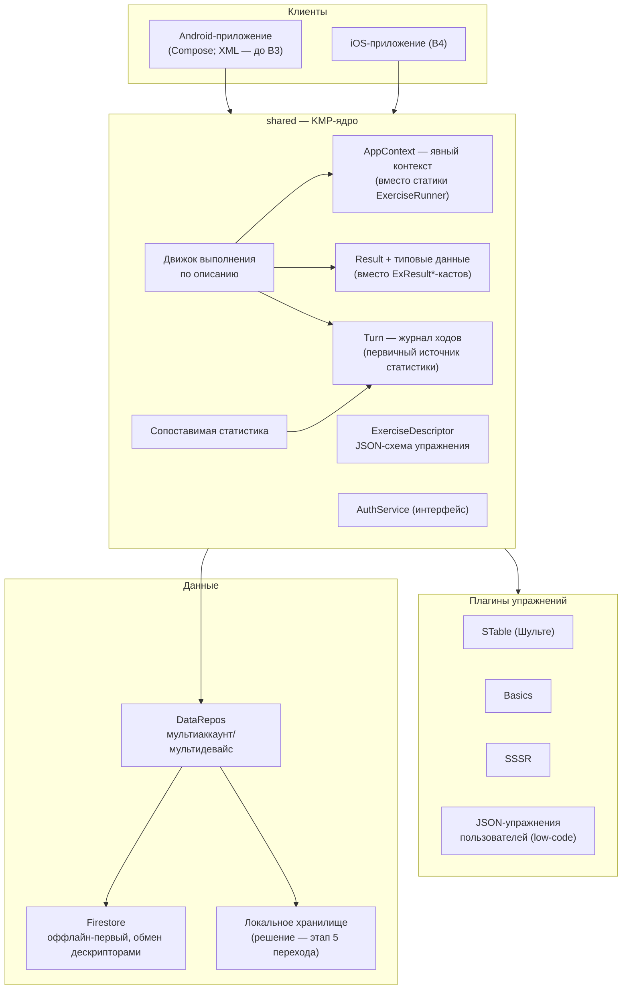

# Архитектура приложения «Внимание Шульте Плюс» (Schulte Plus)

> Версия документа: 0.1 (2026-08-15). Рабочий детальный as-is с ответами на вопросы —
> `temp/architecture_v119.md` (переносится сюда при консолидации).

## 1. Vision — направление развития

Цель развития: превратить приложение в **платформу упражнений**.

> Приложение — платформа, к которой можно подгрузить JSON-описание упражнения (low-code).
> Приложение выполняет его для пользователя, позволяет делиться им с другими пользователями
> и ведёт сопоставимую статистику эффективности работы/тренировки/игры.

Следствия vision:

- **Упражнение = дескриптор (JSON) + опциональный код (плагин).** Штатные упражнения
  (STable/Шульте, Basics, SSSR) мигрируют на эту модель. Конфигурация (размерность, символы,
  вероятностное распределение dX/dY/w и т.п.) — данные дескриптора, не код.
- **Обмен:** дескрипторы публикуются/импортируются между пользователями (Firestore).
- **Сопоставимая статистика:** единая схема результата (базовый `Result` + типовые данные)
  и журнал ходов (`Turn`) как первичный источник → анализ скорости выполнения задач
  сопоставим между любыми упражнениями (ключевая перспективная фича).
- **Мультиаккаунт/мультидевайс** — базовое свойство (dual-write: локально + Firestore).
- **Прокачка** (quiz, замки achievements/purchase/cert, статусы) — после стабилизации
  платформы; подсчёт псикоинов сохраняется.

## 2. Текущая архитектура (v119)

- **UI**: XML-активности (Splash/Login/Signup/Main/Invest + по активности на упражнение).
- **Состояние**: `ExerciseRunner` — осознанный глобальный контекст/хаб (синглтон + статика);
  домен читает его статически.
- **Домен**: `Exercise<T extends ExResult>` → `STable`/Basics/SSSR; `SCell`, `Turn`;
  `STable` содержит и логику, и UI (`setViewContent`), и прямую персистенцию (`writeTurn`).
- **Данные**: `ExResult` + 3 подкласса (`ExResultSchulte/Basics/Sssr`) — ORM-сущности
  (`@DatabaseTable`), Firestore-конвертация, `Serializable`; каст-полиморфизм вместо иерархии
  интерфейсов; `ExType` — Gson из `res/raw/ex_types.json` (замки, статусы);
  `DataRepos` — двойная запись ORMLite→SQLite и Firestore (конфликты по времени).
- **Утилиты**: `Utils` (Application) — контекст (костыль), время, HTML-помощники, анимации,
  диалоги.

## 3. Целевая архитектура (модульная, платформа)

Правила: `shared` не знает о клиентах; плагин = дескриптор + минимальный код; статистика
строится из журнала, а не из UI.

## 4. Ключевые архитектурные решения (по ответам на Q1–Q13)

| Решение | Суть |
|---|---|
| Домен и UI разделяются | Свойства ячейки (text/color/imageId) — доменные (Q12); отображение — Compose. `Utils` остаётся набором утилит, контекст-костыль устраняется (Q1) |
| Явный контекст вместо статики | `ExerciseRunner` — глобальный контекст (осознанно, Q2), в новой архитектуре — явный объект, передаваемый зависимостям |
| Result-иерархия | Базовый интерфейс `Result` + специфичные данные по типу упражнения; касты убираются (Q4) |
| Двойная запись — фича | Мультиаккаунт/мультидевайс; сохраняется, пока Firestore не закроет оффлайн-сценарии (Q5, Q3) |
| Журнал ходов — ключевая фича | `Turn` пишется локально и в облако (сбой БД/нет сети не теряет данные); анализ скорости задач — перспективная фича (Q6) |
| Firestore-оффлайн-первый | Возможный отказ от локального хранилища — решение на этапе 5 перехода (Q3) |
| `uak` — пользователь+устройство | Идентификатор ключей сущностей, важен для мультиаккаунтности (Q11) |
| Прокачка — после стабилизации | quiz/замки/статусы отложены (Q7, Q9); псикоины считаются, назначение — позже |

## 5. План перехода

Поэтапный план к этой архитектуре — `docs/MODULAR_TRANSITION.md`.

## Лог изменений

| Дата | Изменение |
|---|---|
| 2026-08-15 | Создан документ: vision (платформа упражнений с JSON-дескрипторами), текущая и целевая архитектура, ключевые решения по ответам Q1–Q13 |
