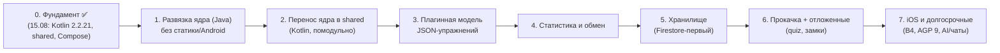

# План перехода к модульной архитектуре (платформа упражнений)

> **Дата:** 2026-08-15. Ветка: `feature/kotlin2`.
> Основан на: `docs/ARCHITECTURE.md` (vision), `temp/architecture_v119.md` (as-is + ответы Q1–Q13).

Цель: модульная архитектура, где упражнение = JSON-дескриптор (+ опциональный код-плагин),
приложение — платформа выполнения, обмена и сопоставимой статистики. Переход — не «сначала
Kotlin, потом модули», а поэтапно: каждый этап заканчивается зелёной сборкой и чек-пойнтом
на устройстве пользователя.

## Обзор этапов

## Этап 1. Развязка ядра на Java — ✅ выполнено 15.08.2026 (d05b6bc…f3537ab)

Цель: ядро работает без статики и Android-зависимостей; приложение поведенчески не меняется.
**STable свободен от Android/Utils/репозиториев** (остались только сущности ExResult/Turn —
уходят в этапе 2). Отложено: глобальная чистка `Utils.getAppContext()` (app-слой, растворяется
при миграции экранов B3); `Identifiable` — до этапа 2.

| Работа | Детали |
|---|---|
| Явный контекст | `ExerciseRunner` → объект `AppContext` (user, exTypeId, symbolType, isRatings, probDx/probDy/probW, exTypes); передаётся конструктором. Статические чтения из STable/ExResult убираются (Q2) |
| Result-иерархия | Базовый `Result` (timeStamp, isValid, numValue, psyCoins, note...) + типовые данные (SchulteData/BasicsData/SssrData); касты в STable заменяются полиморфными методами (Q4) |
| STable без UI и персистенции | `setViewContent` → в GridAdapter (Q12); `writeTurn` → интерфейс `TurnWriter`, реализация в app (Q6); Utils-вызовы (HTML/цвета) — параметрами или интерфейсами (Q10, Q1) |
| Utils | Убрать контекст-костыль (контекст передаётся явно); время/форматирование — кандидаты на перенос (Q1) |
| Идентичность | Интерфейс `Identifiable` остаётся в app до этапа 2, но становится единственным источником ключей (uak.id) (Q11) |

Чек-пойнт: `assembleDebug` + полный ручной проход (вход, Schulte, Basics, SSSR, статистика).
Риск: регрессы при смене конструкторов — инкрементально, сборка после каждой правки.

## Этап 2. Перенос ядра в shared (Kotlin) — 3–5 дней

Порядок (по модулю; drop-in: Kotlin-класс в том же пакете, Java-файл удаляется на шаге — Q13):

1. `timeStampU`/время — ✅ готово; `Identifiable` → shared (a11).
2. `Result` + типовые данные (замена `ExResult*`; ORM-аннотации остаются в app, см. этап 5).
3. `Turn` → shared (модель журнала, без ORM).
4. Логика `STable` → shared: camelSurface, probabilities, shuffle, journal, validateResult (Q8: параметры — конфигурация).
5. `ExType` → shared: модель + статусы; JSON через kotlinx-serialization (Gson уходит из ядра),
   app передаёт строку из `res/raw` (Q7: quiz-методы отложены).
6. `AuthService` (интерфейс) → shared (основа B2).

Чек-пойнт каждого шага: `assembleDebug` + smoke (запуск, упражнение, сохранение результата).

## Этап 3. Плагинная модель упражнений — 5–10 дней

| Работа | Детали |
|---|---|
| `ExerciseDescriptor` v1 | JSON-схема: id, название, тип рендера (grid/canvas), параметры (размерность, символы, dX/dY/w), правила валидности, шаблон статистики |
| Реестр плагинов | Встроенные (STable/Basics/SSSR) + загружаемые дескрипторы; фабрика «дескриптор → экземпляр упражнения» |
| Движок | Общая обвязка: журнал ходов, тайминги, завершение, начисление псикоинов |
| Валидация | Проверка загружаемых JSON перед выполнением (песочница: размеры, типы, лимиты) |
| Миграция | STable → первый плагин (проверка концепции), затем Basics, SSSR |

Чек-пойнт: одно штатное упражнение (Шульте) выполняется через дескриптор; загружаемый
JSON-дескриптор выполняется в отладочной сборке.

## Этап 4. Статистика и обмен — 3–5 дней

- Единая схема результата (ResultBase + payload) с конвертацией старой схемы `exresult` (миграция данных).
- Журнал ходов — первичный источник аналитики скорости (Q6); визуализация в Compose.
- Сопоставимые метрики: скорость/точность/эффективность по единым формулам между упражнениями.
- Шеринг: публикация/импорт дескрипторов через Firestore; каталог упражнений.

Чек-пойнт: статистика нового JSON-упражнения строится автоматически из журнала.

## Этап 5. Хранилище — 2–4 дня

- Решение по Q3: Firestore работает оффлайн — оценить отказ от локального хранилища.
- Варианты: (1) Firestore как единственный источник (кэш GMS), (2) сохранить dual-write,
  (3) SQLDelight (KMP-БД) как локальный кэш.
- До решения dual-write сохраняется как фича (Q5: мультиаккаунт/мультидевайс).

Чек-пойнт: сценарии оффлайн/онлайн/смена аккаунта на устройстве.

## Этап 6. Прокачка и отложенные фичи

quiz, замки (achievements/purchase/cert), статусы `FUNC_STATUS_*` — после стабилизации
платформы (Q7, Q9). Подсчёт псикоинов сохраняется.

## Этап 7. iOS и долгосрочные

iOS-фундамент (B4, shared framework), AGP 9 (B5), roadmap из `docs/chat.txt`:
TileSquashPaving, обновление графики, новости/чаты/секвенсор/AI.

## Правила итерации

- Каждый этап/шаг: `assembleDebug` → установка на устройство → smoke → коммит (правило «б»).
- Незавершённая правка не остаётся на ночь: зелёная сборка или откат.
- Ветка `feature/kotlin2`; `release/v119-api36` не трогаем до публикации 119.

## Лог изменений

| Дата | Изменение |
|---|---|
| 2026-08-15 | **Этап 1 выполнен** (коммиты d05b6bc, 256464f, da9ef83, bd327a6, f3537ab): AppContext (явный контекст), ExResult* без статики ExerciseRunner, полиморфный update(ExerciseStats) + фабрика ExResult.create вместо кастов, TurnWriter/DefaultTurnWriter (персистенция вне домена), рендер ячеек в GridAdapter, SymbolTemplate/ResourceSymbolTemplate, ResultSaver/DefaultResultSaver, ExerciseServices. STable не зависит от Android/Utils/репозиториев. Осталось: ручной smoke-проход на устройстве |
| 2026-08-15 | Создан документ: поэтапный план перехода к модульной архитектуре (7 этапов), с чек-пойнтами и правилами итерации |
