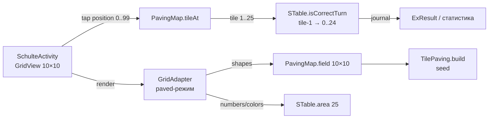

# ТЗ: Упражнение «Мешанина» (gcb_schulte_4_mishmash)

## 1. Обзор

«Мешанина» — упражнение пространства Schulte, уже объявленное в `res/raw/ex_types.json` как
`gcb_schulte_4_mishmash` (`nameEn: "Mishmash"`, родитель `gcb_space_schulte`).
В меню пункт отключён: `"status": 0` = `ExType.FUNC_STATUS_PLANNED` (`ExType.java:53`),
`"coming_soon": true`; в `SchulteSettings.java` (строка ~511) такие пункты получают бейдж
«in progress» и блокируются (`setEnabled(false)`).

Цель — реализовать механики замощения площади плитками разных размеров поверх классического
поиска чисел Шульте. Основа — существующий алгоритм `TileSquashPaving.java`
(`app/src/main/java/org/nebobrod/schulteplus/common/TileSquashPaving.java`).

## 2. Игровая механика

- Визуальное поле: матрица **10×10** ячеек (GridView).
- Поле полностью замощено **25 плитками**; каждая плитка — прямоугольник из
  `TILE_SIZES = {{2,2},{1,2},{2,1},{2,3},{3,2},{1,3},{3,1},{1,4},{4,1},{1,1}}`,
  покрывает от 1 до 4 ячеек. Пустых ячеек нет.
- Каждая плитка изображает одно число **от 1 до 25** (все числа по одному разу; во всех
  ячейках плитки отображается её число). Тип символа — по общей настройке упражнения
  (числа, буквы, цвета).
- Порядок поиска: 1 → 2 → … → 25 (как в классической таблице Шульте).
- **Тап по любой ячейке матрицы ассоциируется с плиткой, которой принадлежит ячейка:
  в обработчик STable уходит число этой плитки.**
- Отличие от классики: число расположено на фигуре неправильной формы, требуется
  пространственный поиск, а не считывание строки/столбца.

## 3. Базовый алгоритм: TileSquashPaving

Существующая реализация — консольное демо с `main()`; поле и плитки — статические.

Параметры (уже заложены в код):

- логическое поле 5×5 = 25 плиток; физическое поле `ROWS*2 × COLS*2` = **10×10**
  (стартовая раскладка — все плитки 2×2);
- «сжатие»: плитка случайно тянет/толкает одну из 4 сторон, рекурсивно проверяются
  зависимые соседи (`canMove`/`getDepends`/`dependCheck`/`dependMove`);
- останов: индекс разнообразия размеров `diversity10x()` ≤ 20 (`DIVERSITY_MIN_TARGET`)
  или 39 циклов (`CYCLES_LIMIT`); сохраняется лучшее поле;
- вывод: `int[10][10]`, каждая ячейка содержит номер плитки 1..25.

## 4. Архитектурное решение

**Ядро `STable` не меняется** (обратная совместимость):

- `STable` остаётся логическим 5×5: 25 ячеек `SCell` со значениями 1..25,
  `isCorrectTurn(position 0..24)`, журнал ходов, `shuffle()`, seed.
- Визуальное поле 10×10 — надстройка (адаптер) поверх.



### 4.1 `TilePaving` — рефакторинг `TileSquashPaving`

```kotlin
// shared/src/commonMain/kotlin/org/nebobrod/schulteplus/common/TilePaving.kt
class TilePaving(seed: Long) {
    fun build(): Array<IntArray> // 10×10, ячейка = номер плитки 1..25
}
```

- **Язык: Kotlin, сразу в `shared/commonMain`** (целевой язык миграции — ядро
  упражнений переезжает туда же; Java-код `STable`/`GridAdapter` вызывает Kotlin
  без изменений, интероп уже настроен — пример `Const.kt`).
- Убрать статическое состояние (`field`, `tiles`, `TILE_QUANTITIES_BY_SIZE`),
  консольный вывод, debug-ветки (`DEBUG_SETTINGS`) и `Math.random()`;
  RNG — `kotlin.random.Random(seed)`.
- **Детерминизм: один и тот же seed → одно и то же замощение.** Seed берётся из
  `STable.getSeed()` (уже фиксируется в `ExResult` — воспроизводимость статистики).
- `TILE_SIZES`, `diversity10x`, `getTileSize`, `getOpposite` переносятся как есть.

### 4.2 `PavingMap` — отображение ячеек ↔ плиток (чистый домен, unit-тестируемый)

```kotlin
// shared/src/commonMain/kotlin/org/nebobrod/schulteplus/common/PavingMap.kt
class PavingMap(private val field: Array<IntArray>) { // 10×10, значения 1..25
    fun tileAt(position10x10: Int): Int          // 0..99 → 1..25
    fun tileAt(row: Int, col: Int): Int
    fun cellsOfTile(tileNum: Int): List<Int>     // все ячейки плитки
    fun anchorCell(tileNum: Int): Int            // репрезентативная ячейка для hint
    fun isOuterSide(row: Int, col: Int, side: Int): Boolean // сторона на периметре плитки
}
```

(Тот же файл-каталог, что и `TilePaving` — Kotlin, `shared/commonMain`.)

### 4.3 Обработка тапа (`SchulteActivity.onItemClick`)

```java
int tile = pavingMap.tileAt(position);   // 0..99 → 1..25
exercise.isCorrectTurn(tile - 1);        // тап плитки = тап её числа
```

Логика верна и после `shuffle()`: форма плитки N зафиксирована в `field`,
а число внутри формы берётся из `area.get(N-1)` — `shuffle()` перемешивает числа
между формами.

### 4.4 Отрисовка (`GridAdapter`, новый case `KEY_PRF_EX_S4`)

- `getCount()` = 100 (paved-режим);
- ячейка (row, col) отображает текст/цвет `area.get(field[row][col] - 1)`
  (тот же `setCellView`, что для S1/S2/S3 — числа/буквы/цвета работают без изменений);
- границы: `ic_border` рисуется только по периметру плитки — на каждой стороне ячейки,
  где сосед принадлежит другой плитке (или край поля); внутренние границы плитки
  отсутствуют, плитка выглядит единой фигурой.

> **Язык UI-прослойки:** `GridAdapter` и `SchulteActivity` остаются на Java —
> это Android-прослойка View-системы (GridView, Drawable), а миграция UI идёт
> на Compose, игровой экран упражнения в неё не входит. Классы домена
> (`TilePaving`, `PavingMap`) — Kotlin в `shared/commonMain`; Java вызывает их
> напрямую.

### 4.5 Подсказка (long-click)

- `exercise.getExpectedPosition()` (0..24) → плитка `pos + 1` →
  `pavingMap.anchorCell(...)` → существующая `animThrob` над центральной ячейкой плитки.
  (Опция: подсвечивать все ячейки плитки.)

## 5. Интеграция

| Место | Изменение |
|---|---|
| `ex_types.json` | `gcb_schulte_4_mishmash`: `"status": 0 → 2` (`FUNC_STATUS_PRODUCTION`), `"coming_soon": false` |
| `SchulteSettings.java` (~511) | гейт `FUNC_STATUS_PLANNED` перестаёт блокировать пункт автоматически; проверить локализацию названия (`nameEn "Mishmash"` → RU «Мешанина») |
| `SchulteActivity.initArea()` | при `exTypeId == KEY_PRF_EX_S4`: `mGrid.setNumColumns(10)`, создание `TilePaving(seed)` + `PavingMap`, адаптер в paved-режиме |
| `GridAdapter` | paved-режим: `getCount()=100`, case S4, рамки по периметру плиток |
| `TileSquashPaving.java` | перенос алгоритма в `shared`: `TilePaving.kt` (п. 4.1); Java-файл удаляется после переноса |
| `Const.kt` | ID уже есть: `KEY_PRF_EX_S4 = "gcb_schulte_4_mishmash"` — изменений не требуется |

## 6. Статистика и воспроизводимость

- `STable.journal` / `calculateResults()` работают без изменений: ходы — логические
  позиции 0..24.
- В `Turn` записываются `turnX/turnY` логических координат плитки (не физической
  ячейки) — допустимо: статистика отражает поиск плитки.
- Seed фиксирует и замощение, и раскладку чисел: одинаковый seed → одинаковое
  упражнение целиком.

## 7. Риски и ограничения

- Производительность: один прогон алгоритма ≈ 39 циклов × 25 плиток с рекурсивными
  проверками. Ожидаемо укладывается в единицы мс — строить синхронно при `initArea()`;
  замерить; при необходимости увести в фоновый поток (`AppExecutors` уже есть).
- Читаемость: ячейки 10×10 мельче классических — проверить формулу textScale
  в `GridAdapter.getView()` (двузначные числа 1..25).
- `TilePickPaving` (тот же формат 10×10/25) имеет известный дефект «3–7 плиток не
  помещаются» — не использовать (см. п. 9).
- Пустых ячеек быть не должно — тест полноты замощения (этап 2).

## 8. Этапы реализации

1. **Перенос алгоритма в `TilePaving.kt`** (Kotlin, `shared/commonMain`): инстанс-класс
   с `seed`, убрать static-состояние, console/debug-код, `Math.random()`;
   RNG — `kotlin.random.Random(seed)`. Java-файл `TileSquashPaving.java` удаляется
   после переноса.
2. **Тесты** (`shared/src/commonTest/kotlin/.../TilePavingTest.kt`, kotlin.test;
   существующий JVM-файл `app/src/test/java/.../TilePavingTest.java` заменяется):
   - полнота: 100 ячеек покрыто, ровно 25 плиток, нулей нет;
   - размеры всех плиток ⊆ `TILE_SIZES`;
   - детерминизм: одинаковый seed → одинаковое поле;
   - инварианты `PavingMap`: биекция ячеек ↔ плиток, `anchorCell` внутри плитки.
3. **`PavingMap`** (п. 4.2).
4. **`GridAdapter` paved-режим** (п. 4.4).
5. **`SchulteActivity`**: numColumns=10, маппинг тапа, hint через `anchorCell`.
6. **Активация**: `ex_types.json` + проверка `SchulteSettings`.
7. **Ручное тестирование на устройстве**: отрисовка границ плиток, тапы, shuffle,
   hint, статистика после завершения.

## 9. Альтернативы (рассмотрены)

- `TilePickPaving` — та же цель (10×10, 25 плиток), но алгоритм не укладывает все
  плитки (комментарий в исходнике «ERROR — 3-7 tiles can't be placed») — отклонён.
- `TileFilling`, `TileBranchPaving` — другие стратегии замощения; могут стать будущими
  вариантами «Мешанины» (сменные layout-стратегии, в ТЗ не входят).

## 10. Реализация (журнал этапов)

| Этап | Дата | Статус | Замечания |
|---|---|---|---|
| 1. `TilePaving.kt` | 2026-08-23 | ✅ готов | Перенос 512 Java → 322 Kotlin: убраны static-состояние, консоль/ANSI-вывод, `DEBUG_SETTINGS`, `Math.random()`. RNG — `kotlin.random.Random(seed)`. Подводные камни переноса: (а) Java позволял присваивать `null` в `List` (перезапись в `dependMove`) — в Kotlin тип `List<Int>?`; (б) `private`-методы inner-класса видны внешнему классу в Java (synthetic accessors), в Kotlin — нет, снят `private`. Баг оригинала: `resultField = field` копировал ссылку («лучшее поле» не фиксировалось) — в Kotlin глубокая копия `copyField`. Проверка: компилятор 2.2.21 (из gradle-кэша) + smoke: 10×10, 25 плиток, 100 ячеек, детерминизм seed. `TileSquashPaving.java` НЕ удалён — его использует `TilePavingTest.java`; удаление вместе с этапом 2. Полная gradle-сборка не запускалась (рабочее дерево коллеги, ветка feature/kotlin2). |
| 2. Тесты | 2026-08-23 | ✅ готов | `shared/commonTest/TilePavingTest.kt` (kotlin.test): полнота 10×10 и 25 плиток (seed 0..9), размеры плиток ⊆ `TILE_SIZES` с проверкой прямоугольности через bounding-box, детерминизм (seed 0,1,42,2026 — два прогона идентичны). Нюанс: `kotlin.test.Test` в 2.2.x — expect-аннотация из KMP-metadata, ручная JVM-компиляция её не резолвит (только Gradle-сборка); логика проверена временным runner'ом без аннотации — все asserts прошли. Тесты инвариантов `PavingMap` перенесены на этап 3 (класс создаётся там). `TilePavingTest.java` (app/src/test) ещё жив — ссылается на `TileSquashPaving.main`; замена/удаление вместе с удалением Java-файла (после этапа 3). |
| 3. `PavingMap` | 2026-08-23 | ✅ готов | `shared/commonMain/PavingMap.kt` + `shared/commonTest/PavingMapTest.kt` (тесты-инварианты, перенесённые с этапа 2). Позиции ячеек — row-major 0..99 (порядок GridView, под интеграцию этапа 4). `anchorCell` — центр bounding-box плитки (для чётных размеров — верхняя-левая из центральной пары, всегда внутри плитки). `isOuterSide` — определение через соседа (согласовано с TilePaving: 0 East, 1 South, 2 West, 3 North); контракт сторон пригодится на этапе 4 для рамок плиток. Валидация: `require` 10×10 в init, `require` диапазонов в методах. Тесты (seed 0..9): биекция `cellsOfTile` ↔ `tileAt` (без пересечений, ровно 100 позиций), `anchorCell` внутри плитки, периметр по определению соседства, согласованность `tileAt(row,col)` = `tileAt(row*10+col)`. Прогон: OK. |
| 4. `GridAdapter` paved | 2026-08-23 | ✅ готов | `GridAdapter.java` (app): `setPavingMap(PavingMap)` — null = классика без изменений; иначе `getCount()=100`, ячейка = `area.get(tile-1)` (та же switch-логика S1/S2/S3/default), рамки — новый `PavedCellDrawable.java` (common): рамка 2dp только по сторонам, где `isOuterSide(row,col,side)` true (конвенция сторон TilePaving/PavingMap); заливка прозрачная, цвет рамки — прежний `light_grey_D`. База правок — АКТУАЛЬНАЯ версия GridAdapter из feature/kotlin2 (коллега перенёс отрисовку из STable в `setCellView`, шаг 1.4); правки наложены на неё, прежний код не тронут. Проверка: javac — синтаксис чист (android.jar нет — полная компиляция произойдёт при gradle-сборке, этап 5-6). |
| 5. `SchulteActivity` | 2026-08-23 | ✅ готов | `SchulteActivity.java` (ui/schulte): `initArea()` — при `KEY_PRF_EX_S4`: `PavingMap(TilePaving(exercise.getSeed()).build())`, `setNumColumns(10)`, `adapter.setPavingMap(map)`; иначе классика. Тап: `turnPosition = isPaved ? pavingMap.tileAt(position) - 1 : position` → `isCorrectTurn(turnPosition)` (иначе `getArea().get(position)` с position>24 упал бы). Hint: `anchorCell(expected + 1)` вместо `expected` в `getChildAt`. Поля `pavingMap`/`isPaved` в Activity; правки наложены на актуальную версию feature/kotlin2 (коллега правил файл — edge-to-edge insets, шаги миграции). Проверка: javac — синтаксис чист. |
| 6. Активация | 2026-08-23 | ✅ готов | `ex_types.json`: `gcb_schulte_4_mishmash` — `status 0→2` (PRODUCTION), `coming_soon true→false`; JSON валиден. `SchulteSettings.java` (474-478): гейт `FUNC_STATUS_PLANNED` снимается автоматически — правок не требуется. Локализация уже есть: `values-ru/strings.xml` — «Мешанина!» (+ sum), `values/strings.xml` — «Mishmash!»; nameRu в ex_types.json не используется. ВАЖНО: у S4 есть `achieveConditions` (purchased recordValue='10', certified) — после активации пункт требует покупки/сертификации; для ручного теста (этап 7) может понадобиться достижение. |
| 7. Ручное тестирование | 2026-08-24 | 🔄 в работе | Чек-лист — п. 10.1. Билд собран, таблица формируется и отображается. TP-13/TP-14/TP-16 подтверждены; TP-15/TP-17/TP-18 — «готов к проверке» (одно число на плитку с растяжкой; розовая вспышка плитки при ошибке — `setSelector(null)` + `mishmash_pink`; пульс плитки +10/−10% за 0.5 с). SP-09 в BACKLOG (опция масштаба символов: растяжка/единый размер). Ожидается повторная сборка и проверка. |

### 10.1 Чек-лист этапа 7 (ручное тестирование на устройстве)

**Подготовка**

- [ ] Сборка ветки feature/kotlin2 с правками этапов 1–6: `./gradlew assembleDebug`, установка APK
- [ ] Пункт «Мешанина» виден и активен в настройках Schulte (без бейджа «in progress», без блокировки)
- [ ] Если пункт не открывается: у S4 есть `achieveConditions` (purchased recordValue='10', certified) — проверить InvestActivity; при необходимости временно убрать `achieveConditions` из `ex_types.json` (вернуть после теста)

**Отрисовка**

- [ ] Сетка 10×10 (100 ячеек), пустых ячеек нет
- [ ] Ровно 25 плиток; размеры только из `TILE_SIZES` (2×2, 1×2, 2×1, 2×3, 3×2, 1×3, 3×1, 1×4, 4×1, 1×1)
- [ ] Рамки — только по периметру плитки; внутренних границ нет, плитка выглядит единой фигурой
- [ ] Числа 1..25 видны, каждое — на своей плитке (в каждой ячейке плитки — её число)
- [ ] Двузначные числа читаемы (textScale не обрезает); при мелком экране — проверить переносы
- [ ] Квадратный режим (isSquared) — ячейки квадратные, без перекосов

**Поведение**

- [ ] Тап по ЛЮБОЙ ячейке плитки N = тап числа N (начинать с 1: тап по любой ячейке плитки с «1» → переход к 2)
- [ ] Ошибочный тап (не та плитка) — реакция как в классике (счётчик ошибок, hint-подсветка при isHinted)
- [ ] Порядок поиска 1 → 2 → … → 25
- [ ] Shuffle (если включён): числа переезжают между ФОРМАМИ плиток, сами формы не меняются
- [ ] Hint (long-click): анимация над центром ожидаемой плитки (не в углу, не на соседней)
- [ ] Завершение: после 25 — диалог результата; «Ещё раз» — новое замощение (другой seed)
- [ ] Countdown-режим (если включён): отсчёт → shuffle → поле соответствует
- [ ] Ориентация экрана — приложение не ломается (как в S1)

**Статистика и воспроизводимость**

- [ ] После завершения: журнал ходов корректен (25 корректных ходов, позиции плиток 0..24)
- [ ] В ExResult зафиксирован seed; повторный запуск с тем же seed (если доступен) даёт то же замощение
- [ ] Время хода и ошибки отображаются как в классике

**Производительность и регрессия**

- [ ] Старт упражнения без заметной паузы (TilePaving.build() синхронно в initArea)
- [ ] S1 (классика 5×5): рамки у каждой ячейки, тапы — без изменений
- [ ] S2/S3 (двойные/4-цветные последовательности): без изменений
- [ ] Быстрый двойной тап по одной ячейке — без краша
- [ ] Скролл/возврат на экран настроек — без утечек видимости пункта

## Лог изменений

| Дата | Изменение |
|---|---|
| 2026-08-16 | Создан ТЗ: механика 10×10, 25 плиток, адаптер `PavingMap`, рефакторинг `TileSquashPaving` → `TilePaving(seed)`, интеграция и этапы |
| 2026-08-16 | Решение о языке: домен (`TilePaving`, `PavingMap`) — Kotlin в `shared/commonMain` (`kotlin.random.Random(seed)`); UI-прослойка (`GridAdapter`, `SchulteActivity`) — Java (View-система, вне миграции); тесты — `shared/commonTest` |
| 2026-08-24 | TP-13/TP-14 исправлены (см. п.10, этап 7): case `KEY_PRF_EX_S4` в `GridAdapter.setCellView`; `throbTile()` по всем ячейкам плитки в `SchulteActivity` |
| 2026-08-24 | TP-15/TP-16 исправлены: число плитки рисует `PavedCellDrawable` (canvas.scale по bbox, `PavingMap.tileBounds`); вспышка плитки целиком — `flashTile` (заливка + refresh) |
| 2026-08-24 | TP-17/TP-18 исправлены: `setSelector(null)` в paved + ресурс `mishmash_pink` #E91E63 (ошибка — розовая плитка); пульс плитки целиком (ScaleAnimation, pivot = центр плитки, +10/−10% за 0.5 с) |
| 2026-08-24 | TP-19: анимация границы плитки (setBorderColor), символ не перекрывается. Реализованы три режима кегля (`prf_font_scale`): −1 маленький, 0 максимальный (longestSymbol), 1 плитка (stretch) — классика и Мешанина |
