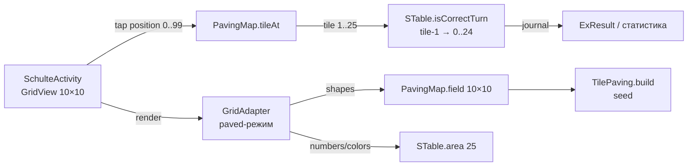

# ТЗ: Упражнение «Мешанина» (gcb_schulte_4_mishmash)

## 1. Обзор

«Мешанина» — упражнение пространства Schulte, уже объявленное в `res/raw/ex_types.json` как
`gcb_schulte_4_mishmash` (`nameEn: "Mishmash"`, родитель `gcb_space_schulte`).
В меню пункт отключён: `"status": 0` = `ExType.FUNC_STATUS_PLANNED` (`ExType.java:53`),
`"coming_soon": true`; в `SchulteSettings.java` (строка ~511) такие пункты получают бейдж
«in progress» и блокируются (`setEnabled(false)`).

Цель — реализовать механики замощения площади плитками разных размеров поверх классического
поиска чисел Шульте. Основа — существующий алгоритм `TileSquashPaving.java`
(`app/src/main/java/org/nebobrod/schulteplus/common/TileSquashPaving.java`).

## 2. Игровая механика

- Визуальное поле: матрица **10×10** ячеек (GridView).
- Поле полностью замощено **25 плитками**; каждая плитка — прямоугольник из
  `TILE_SIZES = {{2,2},{1,2},{2,1},{2,3},{3,2},{1,3},{3,1},{1,4},{4,1},{1,1}}`,
  покрывает от 1 до 4 ячеек. Пустых ячеек нет.
- Каждая плитка изображает одно число **от 1 до 25** (все числа по одному разу; во всех
  ячейках плитки отображается её число). Тип символа — по общей настройке упражнения
  (числа, буквы, цвета).
- Порядок поиска: 1 → 2 → … → 25 (как в классической таблице Шульте).
- **Тап по любой ячейке матрицы ассоциируется с плиткой, которой принадлежит ячейка:
  в обработчик STable уходит число этой плитки.**
- Отличие от классики: число расположено на фигуре неправильной формы, требуется
  пространственный поиск, а не считывание строки/столбца.

## 3. Базовый алгоритм: TileSquashPaving

Существующая реализация — консольное демо с `main()`; поле и плитки — статические.

Параметры (уже заложены в код):

- логическое поле 5×5 = 25 плиток; физическое поле `ROWS*2 × COLS*2` = **10×10**
  (стартовая раскладка — все плитки 2×2);
- «сжатие»: плитка случайно тянет/толкает одну из 4 сторон, рекурсивно проверяются
  зависимые соседи (`canMove`/`getDepends`/`dependCheck`/`dependMove`);
- останов: индекс разнообразия размеров `diversity10x()` ≤ 20 (`DIVERSITY_MIN_TARGET`)
  или 39 циклов (`CYCLES_LIMIT`); сохраняется лучшее поле;
- вывод: `int[10][10]`, каждая ячейка содержит номер плитки 1..25.

## 4. Архитектурное решение

**Ядро `STable` не меняется** (обратная совместимость):

- `STable` остаётся логическим 5×5: 25 ячеек `SCell` со значениями 1..25,
  `isCorrectTurn(position 0..24)`, журнал ходов, `shuffle()`, seed.
- Визуальное поле 10×10 — надстройка (адаптер) поверх.



### 4.1 `TilePaving` — рефакторинг `TileSquashPaving`

```java
public class TilePaving {
    public TilePaving(long seed);   // !ai внутри java.util.Random(seed)
    public int[][] build();         // int[10][10], ячейка = номер плитки 1..25
}
```

- Убрать статическое состояние (`field`, `tiles`, `TILE_QUANTITIES_BY_SIZE`),
  консольный вывод, debug-ветки (`DEBUG_SETTINGS`) и `Math.random()`.
- **Детерминизм: один и тот же seed → одно и то же замощение.** Seed берётся из
  `STable.getSeed()` (уже фиксируется в `ExResult` — воспроизводимость статистики).
- `TILE_SIZES`, `diversity10x`, `getTileSize`, `getOpposite` остаются как есть.

### 4.2 `PavingMap` — отображение ячеек ↔ плиток (чистый домен, unit-тестируемый)

```java
public class PavingMap {
    public PavingMap(int[][] field);              // 10×10, значения 1..25
    public int tileAt(int position10x10);         // 0..99 → 1..25
    public int tileAt(int row, int col);
    public List<Integer> cellsOfTile(int tileNum); // все ячейки плитки
    public int anchorCell(int tileNum);            // репрезентативная ячейка для hint
    public boolean isOuterSide(int row, int col, int side); // сторона на периметре плитки
}
```

### 4.3 Обработка тапа (`SchulteActivity.onItemClick`)

```java
int tile = pavingMap.tileAt(position);   // 0..99 → 1..25
exercise.isCorrectTurn(tile - 1);        // тап плитки = тап её числа
```

Логика верна и после `shuffle()`: форма плитки N зафиксирована в `field`,
а число внутри формы берётся из `area.get(N-1)` — `shuffle()` перемешивает числа
между формами.

### 4.4 Отрисовка (`GridAdapter`, новый case `KEY_PRF_EX_S4`)

- `getCount()` = 100 (paved-режим);
- ячейка (row, col) отображает текст/цвет `area.get(field[row][col] - 1)`
  (тот же `setCellView`, что для S1/S2/S3 — числа/буквы/цвета работают без изменений);
- границы: `ic_border` рисуется только по периметру плитки — на каждой стороне ячейки,
  где сосед принадлежит другой плитке (или край поля); внутренние границы плитки
  отсутствуют, плитка выглядит единой фигурой.

### 4.5 Подсказка (long-click)

- `exercise.getExpectedPosition()` (0..24) → плитка `pos + 1` →
  `pavingMap.anchorCell(...)` → существующая `animThrob` над центральной ячейкой плитки.
  (Опция: подсвечивать все ячейки плитки.)

## 5. Интеграция

| Место | Изменение |
|---|---|
| `ex_types.json` | `gcb_schulte_4_mishmash`: `"status": 0 → 2` (`FUNC_STATUS_PRODUCTION`), `"coming_soon": false` |
| `SchulteSettings.java` (~511) | гейт `FUNC_STATUS_PLANNED` перестаёт блокировать пункт автоматически; проверить локализацию названия (`nameEn "Mishmash"` → RU «Мешанина») |
| `SchulteActivity.initArea()` | при `exTypeId == KEY_PRF_EX_S4`: `mGrid.setNumColumns(10)`, создание `TilePaving(seed)` + `PavingMap`, адаптер в paved-режиме |
| `GridAdapter` | paved-режим: `getCount()=100`, case S4, рамки по периметру плиток |
| `TileSquashPaving.java` | рефакторинг в `TilePaving` (п. 4.1) |
| `Const.kt` | ID уже есть: `KEY_PRF_EX_S4 = "gcb_schulte_4_mishmash"` — изменений не требуется |

## 6. Статистика и воспроизводимость

- `STable.journal` / `calculateResults()` работают без изменений: ходы — логические
  позиции 0..24.
- В `Turn` записываются `turnX/turnY` логических координат плитки (не физической
  ячейки) — допустимо: статистика отражает поиск плитки.
- Seed фиксирует и замощение, и раскладку чисел: одинаковый seed → одинаковое
  упражнение целиком.

## 7. Риски и ограничения

- Производительность: один прогон алгоритма ≈ 39 циклов × 25 плиток с рекурсивными
  проверками. Ожидаемо укладывается в единицы мс — строить синхронно при `initArea()`;
  замерить; при необходимости увести в фоновый поток (`AppExecutors` уже есть).
- Читаемость: ячейки 10×10 мельче классических — проверить формулу textScale
  в `GridAdapter.getView()` (двузначные числа 1..25).
- `TilePickPaving` (тот же формат 10×10/25) имеет известный дефект «3–7 плиток не
  помещаются» — не использовать (см. п. 9).
- Пустых ячеек быть не должно — тест полноты замощения (этап 2).

## 8. Этапы реализации

1. **Рефакторинг `TileSquashPaving` → `TilePaving(long seed)`**: инстанс-класс, убрать
   static-состояние, console/debug-код, `Math.random()`.
2. **JVM-тесты** (`app/src/test/java/.../TilePavingTest.java`, файл уже существует и
   сейчас гоняет `TileSquashPaving.main(null)`):
   - полнота: 100 ячеек покрыто, ровно 25 плиток, нулей нет;
   - размеры всех плиток ⊆ `TILE_SIZES`;
   - детерминизм: одинаковый seed → одинаковое поле;
   - инварианты `PavingMap`: биекция ячеек ↔ плиток, `anchorCell` внутри плитки.
3. **`PavingMap`** (п. 4.2).
4. **`GridAdapter` paved-режим** (п. 4.4).
5. **`SchulteActivity`**: numColumns=10, маппинг тапа, hint через `anchorCell`.
6. **Активация**: `ex_types.json` + проверка `SchulteSettings`.
7. **Ручное тестирование на устройстве**: отрисовка границ плиток, тапы, shuffle,
   hint, статистика после завершения.

## 9. Альтернативы (рассмотрены)

- `TilePickPaving` — та же цель (10×10, 25 плиток), но алгоритм не укладывает все
  плитки (комментарий в исходнике «ERROR — 3-7 tiles can't be placed») — отклонён.
- `TileFilling`, `TileBranchPaving` — другие стратегии замощения; могут стать будущими
  вариантами «Мешанины» (сменные layout-стратегии, в ТЗ не входят).

## Лог изменений

| Дата | Изменение |
|---|---|
| 2026-08-16 | Создан ТЗ: механика 10×10, 25 плиток, адаптер `PavingMap`, рефакторинг `TileSquashPaving` → `TilePaving(seed)`, интеграция и этапы |
