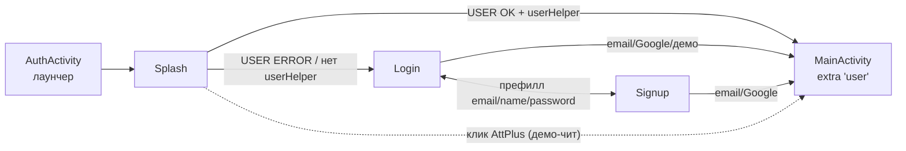

# ТЗ: Редизайн стартовых экранов (Auth + онбординг)

> **Статус:** АНАЛИЗ (черновик ТЗ, открытые вопросы — в разделе 6). Дата: 2026-08-16.
> Ничего не закодировано и не закоммичено. Глубина редизайна определяется после обсуждения раздела 6.

## 1. Контекст и цель

Стартовый флоу переписан на Compose в B2 (коммиты `fdad47f`…`990b83d`): единая
`AuthActivity` (лаунчер) с экранами **Splash → Login ↔ Signup** (state-навигация),
общий контракт `AuthService` (shared), `AuthSession` (success-цепочка). Текущий
вариант — функциональный паритет со старым XML-флоу, но с минимальным UI.

Цель редизайна: сделать старт приложения понятным, быстрым и привлекательным,
а для новых пользователей — познакомить с приложением (онбординг) и связать
с существующей системой интро-туториалов.

## 2. Текущее решение (как устроено)

- **Splash** (Compose, переиспользует Java `SplashViewModel`): 5 проверок
  (APP — версия AdminNote, USER — Firebase-сессия + ORM-запись, NETWORK — ping
  attplus.in, DATA — no-op, TIME — OK сразу, WARN через 8 c); навигация после
  всех 5 (≈2.1 c); snackbar-очередь для WARN/ERROR; индикаторы — 5 цветных точек
  без подписей; полноэкранный (статус-бар скрыт), фон — windowBackground `bg_login02`.
- **Login**: email/пароль (show/hide), кнопки Go on / Google, ссылка «to signup»,
  демо-лок `support@attplus.in`; тосты для ошибок валидации и входа.
- **Signup**: имя/email/пароль + чекбокс согласия, ссылки на политику/соглашение
  (`Utils.displayHtmlAlertDialog`), Go / Google, continue-unregistered → демо-префилл.
- **Онбординг сейчас**: не экраны, а TapTarget-туториалы (`taptargetview 1.15.0`)
  по флагам `showIntro` + битмаска `shownIntros` (`SHOWN_00_MAIN`…`SHOWN_06_*`,
  Const/ExerciseRunner): MainActivity (SHOWN_00_MAIN), BasicsActivity, SchulteSettings,
  HomeFragment, DashboardFragment01/02.

## 3. Плюсы и минусы текущего решения

### 3.1 Splash

| + | − |
|---|---|
| Сообщает статус (юзер/сеть/версия) до входа в Main | ≈2.1 c обязательной задержки (последовательные проверки) |
| Один экран, логика в ViewModel | 5 проверок с гонками: флаг `navigated`, snackbar-очередь — хрупко, сложно тестировать |
| Полноэкранный «брендовый» старт | Точки-индикаторы без подписей — непонятны пользователю |
| | DATA — пустышка; TIME — искусственная проверка с 8-сек WARN-фолбэком (фактически мёртвый сценарий) |
| | Сетевой ping на каждом старте — зависимость от внешнего ресурса |
| | Статус-бар скрыт — нестандартно для современных auth-экранов |
| | «AttPlus»-чит — скрытая функция без UI-объяснения (нужен явный «Попробовать без регистрации») |
| | Текст «AttPlus»/«Run Demo User...» — хардкод, не в строках |

### 3.2 Login

| + | − |
|---|---|
| Material3, простые поля, show/hide пароль, демо-лок | Нет инлайн-валидации (тосты вместо `isError`/`supportingText`) |
| `.imePadding()` — клавиатура не перекрывает поля | **Нет сброса пароля / resend verification / delete account** (отложено B2.1) — пользователь с забытым паролем в тупике |
| Префилл из extras сохраняет контракт `prf_user_delete` | Google-кнопка без брендинга (обычная `Button` с текстом) |
| | Нет autofill-hints — мимо системного менеджера паролей |
| | Ошибка входа — общий тост без причины (Boolean-контракт потерял детализацию) |
| | Нет брендинга (логотип/иллюстрация) — серые поля на фоне |
| | Нет Credential Manager / биометрии (отложено) |
| | Нет анимаций переходов, нет тёмной темы (дефолтная `darkColorScheme`) |

### 3.3 Signup

| + | − |
|---|---|
| Чекбокс согласия + ссылки на политику/соглашение | Два тоста подряд для согласия (title + desc) — плохой UX |
| Префилл login↔signup, continue-unregistered | Нет инлайн-валидации, нет show/hide пароля |
| | Оффлайн-гейт отключает форму без объяснения |
| | Нет статуса «письмо верификации отправлено» на экране |

### 3.4 Общее

| + | − |
|---|---|
| Единый Compose-флоу, state-навигация, переиспользует Java SplashViewModel | Тема минимальна: 6 цветов, без типографики/форм/анимаций |
| Success-цепочки сохранены (AuthSession), контракт «user»-extras цел | Отложенные функции (reset/delete/resend) отсутствуют в UI |
| Firebase-стратегия стабильна (обёртка старого SDK) | Нет аналитики стартового флоу (воронка) |
| | Нет локализации помимо RU/EN-строк |

### 3.5 Онбординг (текущий)

| + | − |
|---|---|
| Точечные туториалы на месте («показать один раз») | Нет welcome-экрана для новых пользователей |
| Битмаска `shownIntros` не мешает опытным | Туториалы разрознены, не скоординированы единым сценарием |
| | `taptargetview` — старая библиотека (1.15.0), нет Compose-версии |
| | Онбординг не связан с идеей платформы (JSON-упражнения, цели/прокачка) |
| | Нет выбора начальных упражнений/целей при старте |

## 4. Варианты оптимизации (по направлениям)

### 4.1 Splash: быстрый старт
- **Вариант A (минимальный):** убрать NETWORK/DATA/TIME-проверки из блокирующего
  пути; навигация сразу по USER-проверке; фоновая проверка версии (APP) — после
  входа в Main. Индикаторы — с подписями (Пользователь / Сеть / Версия) или скрыть.
- **Вариант B (радикальный):** сплэш — чисто брендовая заставка (логотип + имя,
  ~600–900 мс) с параллельной проверкой Firebase-сессии; USER ERROR → Login,
  иначе Main. Проверки версии/сети — фоном в Main.

### 4.2 Auth UX
- Инлайн-валидация: `OutlinedTextField(isError, supportingText)` для email/имени/пароля.
- Загрузка внутри кнопки (spinner в `Button`) вместо отдельного индикатора.
- `autofillHints` (Email/Password/NewPassword) + `KeyboardOptions` (имя — text).
- Единая строка ошибок вместо тостов (или snackbar с причиной).
- Пароль show/hide в Signup тоже.
- **Восстановить B2.1:** ссылка «Забыли пароль?» (`sendPasswordResetEmail`),
  «Выслать письмо верификации повторно», delete-account (re-entry пароля).
- Google-кнопка с официальным логотипом (или `GoogleSignInButton`-эквивалент в Compose).

### 4.3 Брендинг и тема
- Логотип/иллюстрация на Splash/Login; использование `bg_login02` осознанно.
- Тёмная схема для auth-экранов (сейчас `darkColorScheme()` дефолт — почти чёрный,
  не согласован с XML-палитрой).
- Типографика (headline/body из палитры), формы, анимации переходов экранов.
- Статус-бар: решить — показывать (edge-to-edge + insets) или оставить fullscreen
  только на сплэше.

### 4.4 Онбординг (новые welcome-экраны)
- 2–3 экрана для новых пользователей (первый запуск после входа), на основе нового
  битфлага (или расширения `SHOWN_*`):
  1. «Что такое Schulte Plus» (тренировка внимания/скорости);
  2. «Что внутри» (упражнения: Schulte, Basics, SSSR; статистика);
  3. «Начнём?» — выбор первого упражнения → сразу в упражнение.
- Связь с платформенной идеей: экран-каталог упражнений (подготовка к плагинам).
- Судьба TapTarget-туториалов: при появлении онбординга — сократить (оставить
  только точечные подсказки по настройкам) или мигрировать позже.

### 4.5 Техническое
- Состояние флоу вынести из activity-переменных в ViewModel (сейчас `rememberSaveable`
  в `AuthActivity`).
- Вынести строки (AttPlus, демо-сообщения) в `strings.xml`.
- Аналитика воронки: Splash → Login/Signup → Main (Firebase Analytics уже подключён).
- Оффлайн-старт: решить поведение без сети (сейчас формы работают, Firebase-вход — нет).

## 5. Черновик ТЗ (структура; наполняется после решений раздела 6)

### 5.1 Цели
1. Сократить время до первого действия (старт ≤ ~1 c до Login/Main).
2. Понятная навигация и валидация в Auth (без тостов-загадок).
3. Вернуть отложенные функции (сброс пароля, верификация, delete-account).
4. Онбординг для новых пользователей с переходом к первому упражнению.
5. Единый визуальный стиль (брендинг, тёмная тема) и подготовка к платформе.

### 5.2 Сценарии (пользовательские)
- S1. Существующий пользователь: старт → (быстрый сплэш) → Main.
- S2. Новый пользователь: старт → Login/Signup → онбординг (3 экрана) → выбор
  первого упражнения → упражнение → статистика.
- S3. Забыл пароль: Login → «Забыли пароль?» → email → письмо.
- S4. Демо: «Попробовать без регистрации» → Main в демо-режиме.
- S5. Оффлайн: старт без сети → понятное сообщение, формы доступны, вход — после
  восстановления сети.
- S6. Повторный визит: онбординг не показывается (битфлаг), туториалы — по флагам.

### 5.3 Требования по экранам (заполняется по решению глубины)
| Экран | Требования (черновик) |
|---|---|
| Splash | ≤ ~1 c; брендовая заставка; статус-бар — решение 6.2 |
| Login | инлайн-валидация; «Забыли пароль?»; Google-брендинг; autofill; единая ошибка |
| Signup | инлайн-валидация; show/hide; статус письма; оффлайн-объяснение |
| Онбординг | 2–3 экрана; первый запуск; выбор первого упражнения; связь с `SHOWN_*` |

### 5.4 Нефункциональные
- assembleDebug зелёный после каждой итерации; smoke на устройстве.
- Сохранение контрактов: «user»-extra в MainActivity, prefill `prf_user_delete`,
  success-цепочки AuthSession, Firebase-стратегия (старый SDK).
- Локализация (RU/EN строки вынесены), аналитика воронки.

## 6. Открытые вопросы — ✅ РЕШЕНЫ (16.08.2026, D-17…D-20 в Decisions.md)

1. **Splash** → **B**: брендовая заставка ~600–900 мс с параллельной проверкой Firebase-сессии;
   проверки версии/сети — фоном после входа в Main (D-17).
2. **Статус-бар** → показывать на Login/Signup (edge-to-edge + insets); fullscreen — только сплэш (D-20).
3. **Онбординг** → 3 слайда: (1) что это; (2) выбор упражнения с расходом псикойнов (ExType.price);
   (3) предложение регистрации + «Продолжить без регистрации» (демо). Показ — первый запуск
   после входа, новый битфлаг (D-19).
4. **TapTarget** → сократить до минимума (частично заменяет онбординг) (D-20).
5. **Стиль** → полировка Material3 + брендинг (без макетов); полный редизайн — позже (D-18).
6. **Тёмная тема** → делаем, согласованная схема для auth (D-20).
7. **Оффлайн-старт** → понятное сообщение, формы доступны, вход после восстановления сети (D-20).

## Лог изменений

| Дата | Изменение |
|---|---|
| 2026-08-16 | Создан документ: анализ стартовых экранов (Auth + онбординг) — плюсы/минусы текущего Compose-флоу B2, варианты оптимизации, черновик ТЗ, открытые вопросы |
