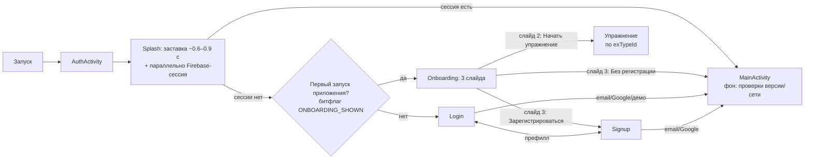

# Проект: Редизайн стартовых экранов (SP-03) — дизайн (Фаза 2)

> Статус: утверждён на шлюзе решений (D-17…D-20). Спецификация: `TZ_StartScreens_Redesign.md`.
> Реализация — Фаза 3 (инкременты внизу).

## 1. Флоу приложения (после редизайна)

**Уточнение момента показа онбординга (поправка к D-19):** слайд 3 «предложение
регистрации» логичен только для анонима → онбординг показывается **до входа**,
на первом запуске приложения (глобальный битфлаг, не по uid).

## 2. Экраны и состояния

### 2.1 AuthActivity (state-навигация, Compose)
`Screen`: SPLASH / LOGIN / SIGNUP / ONBOARDING. Префилл email/name/password из extras
(контракт `prf_user_delete`) — сохранён.

### 2.2 Splash (вариант B)
- Заставка: брендовый фон (существующий `bg_login02` или цветовой блок) + логотип-блок +
  имя приложения + версия; длительность ~600–900 мс.
- Параллельно: `FirebaseAuth.currentUser` → есть → MainActivity; нет → онбординг/Login.
- Проверки версии (AdminNote) и сети — **фоном после входа в Main** (MVP: отложить,
  вернуть при необходимости — см. инкремент 2).
- Индикаторы-точки убраны. Статус-бар: скрыт (fullscreen только на сплэше).

### 2.3 Login
- Поля: email, пароль (show/hide), `autofillHints`, инлайн-валидация (AuthField).
- Кнопки: «Go on» (spinner в кнопке при загрузке), «Log in with Google» (брендинг).
- «Забыли пароль?» → диалог email → `sendPasswordResetEmail` (B2.1 восстановление).
- «Выслать письмо повторно» — если сессия не верифицирована (resend).
- Демо: `support@attplus.in` → лок полей + автовход (сохранено).
- Статус-бар виден (edge-to-edge + insets).

### 2.4 Signup
- Поля: имя, email, пароль (+show/hide), согласие-чекбокс с **одним** пояснением
  (не два тоста), ссылки политика/соглашение (`displayHtmlAlertDialog`).
- Оффлайн: понятное сообщение вместо молчаливого отключения формы.
- Google: GoogleSignInClient (сохранено).

### 2.5 Onboarding (3 слайда, ViewPager/горизонтальный свайп + точки)
| Слайд | Содержимое | Действие |
|---|---|---|
| 1 «Что это» | Логотип, имя, 1–2 строки о тренировке внимания/скорости | «Дальше» |
| 2 «Выбор упражнения» | Карточки пространств (Schulte, Basics, SSSR): название, описание, **расход псикойнов** (`ExType.price`; при 0 — «Бесплатно»), выбор → «Начать» | запуск упражнения по `exTypeId` (демо-режим) или «Дальше» |
| 3 «Регистрация» | Зачем аккаунт (синхронизация, статистика) | «Зарегистрироваться» → Signup; «Продолжить без регистрации» → Main (демо) |

- Битфлаг: глобальный `ONBOARDING_SHOWN` (SharedPreferences без uid) — после завершения/пропуска.
- Данные слайда 2: `ExerciseRunner.getExTypes()` (уже загружаются статически).

## 3. Визуальный стиль и компоненты

### 3.1 Токены (Theme.kt — расширить)
- `LightColors` + `DarkColors` (согласованная тёмная схема, не дефолтная):
  primary `#1E397E` / onPrimary white / primaryContainer `#7681E8`, secondary `#40294C`,
  background `#DDDDDD`, error `#880000`; добавить `surfaceContainer`, `surfaceVariant`,
  `outline` для полей (значения — из светлой палитры `light_grey_*`).
- Типографика: Material3 по умолчанию; формы скругления по умолчанию.
- Статус-бар: `enableEdgeToEdge()` в AuthActivity; `systemBars`-insets на Login/Signup;
  сплэш — без insets (заставка на весь экран).

### 3.2 Компоненты
- `AuthField` — обёртка `OutlinedTextField`: label, error-строка (supportingText),
  `isError`, autofill-hints, optional trailing (show/hide).
- Валидаторы: email (`Patterns.EMAIL_ADDRESS`), name (`Const.NAME_REG_EXP`),
  password (`Const.PASSWORD_REG_EXP`), демо-детект.
- `AuthButton` — Button со встроенным spinner (busy).
- Онбординг-слайдер: `HorizontalPager` (material3) или простой state-переключатель
  (без новой зависимости — выбор при реализации).

## 4. Восстановление B2.1 (в этой итерации)

| Функция | Статус |
|---|---|
| Сброс пароля (`sendPasswordResetEmail`) | ✅ в дизайн; расширить `AuthService` (suspend fun) |
| Resend verification | ✅ в дизайн (условный показ) |
| Delete-account (unpersonalise + reauth) | ⏳ отдельно: сложный флоу; сейчас работает через `prf_user_delete` → AuthActivity с префиллом |
| Скрытые extras (unwrap) | ⏳ не переносим |

## 5. Аналитика воронки (Firebase Analytics)

События: `auth_splash_shown`, `auth_login_started`, `auth_login_success/failure`,
`auth_signup_started/success/failure`, `onboarding_shown`, `onboarding_exercise_selected`,
`onboarding_done`. Код — в app-слое (не в shared).

## 6. Инкременты реализации (Фаза 3)

1. **Стиль+формы**: токены (светлая/тёмная), `AuthField`/`AuthButton`, инлайн-валидация
   в Login/Signup, статус-бар (edge-to-edge + insets), тёмная тема. Сборка ✅.
2. **Splash B**: заставка ~1 c + параллельная сессия; убрать 5-проверочную церемонию;
   фон-проверки — MVP отложить (отметить в Decisions). Сборка ✅.
3. **B2.1**: `AuthService.sendPasswordResetEmail/resendVerificationEmail` +
   FirebaseAuthService + диалоги в Login. Сборка ✅.
4. **Онбординг**: 3 слайда, битфлаг `ONBOARDING_SHOWN`, выбор упражнения с ценой
   (ExType.price), запуск упражнения / регистрация / демо. Сборка ✅.
5. **Аналитика** воронки. Сборка ✅.
6. **TapTarget**: убрать Main-туториал (SHOWN_00_MAIN) — заменён онбордингом; остальные
   оставить. Сборка ✅.
7. **Smoke** (Фаза 4): чек-лист S1–S6 + релиз-готовность.

## 7. Риски фазы 3

- HorizontalPager без новой зависимости — решить при реализации (можно простым state).
- Псикойны: цены сейчас 0 (прокачка отложена, Q7) — слайд 2 показывает «Бесплатно»;
  механика расхода — при включении прокачки.
- Удаление 5-проверочного сплэша теряет версио-чек (AdminNote) — компенсировать
  фоновой проверкой в Main или отложить осознанно.

## Лог изменений

| Дата | Изменение |
|---|---|
| 2026-08-16 | Создан дизайн-документ: флоу с онбордингом (показ до входа — поправка к D-19), экраны, токены/компоненты, восстановление B2.1 (reset/resend; delete — отдельно), аналитика, инкременты Ф3 |
