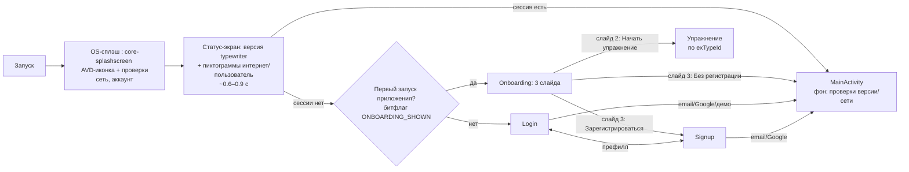

# Проект: Редизайн стартовых экранов (SP-03) — дизайн (Фаза 2)

> Статус: утверждён на шлюзе решений (D-17…D-20), актуализирован D-28/D-29 (23.08).
> Спецификация: `TZ_StartScreens_Redesign.md`. Реализация — Фаза 3 (инкременты внизу).

## 1. Флоу приложения (после редизайна)

**Уточнение момента показа онбординга (поправка к D-19):** слайд 3 «предложение
регистрации» логичен только для анонима → онбординг показывается **до входа**,
на первом запуске приложения (глобальный битфлаг, не по uid).

## 2. Экраны и состояния

### 2.1 AuthActivity (state-навигация, Compose)
`Screen`: SPLASH / LOGIN / SIGNUP / ONBOARDING. Префилл email/name/password из extras
(контракт `prf_user_delete`) — сохранён.

### 2.2 Splash (D-29: стандарт core-splashscreen + статус-экран)

Кастом-сплэш (градиент, логотип-блок, имя, статичная версия, тема `FullscreenStart`)
**убирается** (D-29). Старт — двухслойный:

**Уровень 1 — системная заставка (стандарт `androidx.core:core-splashscreen`).**
Тема `Theme.SchultePlus.Splash` (parent `Theme.SplashScreen`) назначается на
AuthActivity в манифесте; `SplashScreen.installSplashScreen()` — до `super.onCreate`;
`setKeepOnScreenCondition { !isReady }` удерживает заставку, пока идут фоновые
проверки (сеть — доступность бэкенда; аккаунт — Firebase-сессия + UserHelper);
при `isReady` заставка плавно исчезает.

| Параметр | Значение |
|---|---|
| `windowSplashScreenBackground` | брендовый фон — `#1E397E` (старт градиента) |
| `windowSplashScreenAnimatedIcon` | `AnimatedVectorDrawable` логотипа (`splash_logo_avd`) |
| `windowSplashScreenAnimationDuration` | ~600 мс |
| `windowSplashScreenIconBackgroundColor` | круг под иконкой — `#FFFFFF` (контраст) |
| `postSplashScreenTheme` | `Theme.SchultePlus.Start` (тема AuthActivity) |

Тёмная схема: один брендовый фон для обеих схем (!ai — возможны Light/Dark-варианты темы).

**Уровень 2 — статус-экран (Compose, AuthActivity, `Screen.SPLASH` сохраняется):**
- **анимированное написание версии** — typewriter-эффект строки
  `R.string.app_version_full` (resValue из build-переменных `versionCode`/`versionName`
  + суффикс, build.gradle:66-67 — «платформенные переменные»);
- **анимированные статус-пиктограммы** с подписями (состояния: пульс-ожидание → ✓ / ✕):
  - «интернет» — `AppNetwork.isConnected()` (common/AppNetwork.kt);
  - «пользователь» — `FirebaseAuth.currentUser` + UserHelper из ORM (`checkUserSession()`);
  - цвет результатов — из токенов темы;
- **неактивированная учётка** (`emailVerified=false` при наличии сессии, D-26):
  задержка 3 сек с **яркой надписью** о целесообразности активации + действие resend
  (B2.1); TODO: перечень хинтов, выбор случаен;
- навигация (как сейчас): сессия есть → MainActivity; нет → онбординг/Login
  (битфлаг `ONBOARDING_SHOWN`).

**Поправка к D-17:** статус сети возвращается на стартовый флоу (пиктограмма
«интернет»); проверка версии AdminNote — остаётся фоном в Main (StartupChecks).
Статус-бар: OS-сплэш — fullscreen, управляется системой; статус-экран — edge-to-edge.

### 2.3 Login
- Поля: email, пароль (show/hide), `autofillHints`, инлайн-валидация (AuthField).
- Кнопки: «Go on» (spinner в кнопке при загрузке), «Log in with Google» (брендинг).
- «Забыли пароль?» → диалог email → `sendPasswordResetEmail` (B2.1 восстановление).
- «Выслать письмо повторно» — если сессия не верифицирована (resend).
- Демо: `support@attplus.in` → лок полей + автовход (сохранено).
- Статус-бар виден (edge-to-edge + insets).

### 2.4 Signup
- Поля: имя, email, пароль (+show/hide), согласие-чекбокс с **одним** пояснением
  (не два тоста), ссылки политика/соглашение (`displayHtmlAlertDialog`).
- Оффлайн: понятное сообщение вместо молчаливого отключения формы.
- Google: GoogleSignInClient (сохранено).

### 2.5 Onboarding (3 слайда, state-переключатель + точки)
| Слайд | Содержимое | Действие |
|---|---|---|
| 1 «Что это» | Логотип, имя, 1–2 строки о тренировке внимания/скорости | «Дальше» |
| 2 «Выбор упражнения» | Карточки пространств (Schulte, Basics, SSSR): название, описание, **цена в псимонетах** (константы 4/4/4/50/100, TODO SP-06), бейдж кошелька анонима; выбор → «Начать» | **SP03-06**: «Начать» активна только при выборе; нажатие списывает цену из кошелька анонима → слайд 3 |
| 3 «Регистрация» | Зачем аккаунт; **имя анонима** («Вы играете как …»); «Зарегистрироваться»; **«Старт… N»** — неактивная кнопка с обратным отсчётом 5→0 | **D-30**: «Зарегистрироваться» → возврат цены в кошелёк + сброс выбора → Signup; отсчёт 1→0 → автостарт выбранной тренировки (аноним, `start_exercise`) |

- Битфлаг: глобальный `ONBOARDING_SHOWN` (SharedPreferences без uid) — после завершения/пропуска.
- **Аноним (SP03-06/D-30)**: при первом показе онбординга `OnboardingPrefs.ensureAnon` создаёт временный uid (UUID) + случайное имя из `four_letters_nouns` (`Utils.getRandomName`) + стартовый запас 10 псимонет (`ANON_CREDIT`); живёт до logOut; кошелёк — prefs по uid анонима (`KEY_PSYCOINS`), единый источник с ExerciseRunner.

## 3. Визуальный стиль и компоненты

### 3.1 Токены (Theme.kt — расширить)
- `LightColors` + `DarkColors` (согласованная тёмная схема, не дефолтная):
  primary `#1E397E` / onPrimary white / primaryContainer `#7681E8`, secondary `#40294C`,
  background `#DDDDDD`, error `#880000`; добавить `surfaceContainer`, `surfaceVariant`,
  `outline` для полей (значения — из светлой палитры `light_grey_*`).
- **D-28**: полупрозрачные подкладки (`surfaceContainer`/`surfaceContainerHigh`) —
  для **всех** активных элементов Login/Signup (поля, кнопки, ссылки-сниппеты).
- Типографика: Material3 по умолчанию; формы скругления по умолчанию.
- Статус-бар: `enableEdgeToEdge()` в AuthActivity; `systemBars`-insets на Login/Signup;
  OS-сплэш (D-29) — fullscreen, управляется системой; статус-экран — без insets.
- Тема `Theme.SchultePlus.FullscreenStart` уходит из auth-пути (проверить другие
  использования при реализации, !ai).

### 3.2 Компоненты
- `AuthField` — обёртка `OutlinedTextField`: label, error-строка (supportingText),
  `isError`, autofill-hints, optional trailing (show/hide).
- Валидаторы: email (`Patterns.EMAIL_ADDRESS`), name (`Const.NAME_REG_EXP`),
  password (`Const.PASSWORD_REG_EXP`), демо-детект.
- `AuthButton` — Button со встроенным spinner (busy).
- Онбординг-слайдер: `HorizontalPager` (material3) или простой state-переключатель
  (без новой зависимости — выбор при реализации).

## 4. Восстановление B2.1 (в этой итерации)

| Функция | Статус |
|---|---|
| Сброс пароля (`sendPasswordResetEmail`) | ✅ в дизайн; расширить `AuthService` (suspend fun) |
| Resend verification | ✅ в дизайн (условный показ) |
| Delete-account (unpersonalise + reauth) | ⏳ отдельно: сложный флоу; сейчас работает через `prf_user_delete` → AuthActivity с префиллом |
| Скрытые extras (unwrap) | ⏳ не переносим |

## 5. Аналитика воронки (Firebase Analytics)

События: `auth_splash_shown`, `auth_login_started`, `auth_login_success/failure`,
`auth_signup_started/success/failure`, `onboarding_shown`, `onboarding_exercise_selected`,
`onboarding_done`. Код — в app-слое (не в shared).

## 6. Инкременты реализации (Фаза 3)

Фактически выполнено (20.08, каждый: `assembleDebug` ✅ → коммит):

1. **Inc 1 — Splash B** (`8548227`): заставка ~600 мс + параллельная проверка сессии;
   SplashViewModel удалён; фон-проверки версии/сети — `common/StartupChecks.kt` в Main.
2. **Inc 2 — Тема + компоненты + edge-to-edge** (`de0cc8d`): порт токенов (тёмная схема),
   `AuthComponents`/`OnboardingComponents`, тема `.Start`, `enableEdgeToEdge`.
3. **Inc 3 — Онбординг** (`8d641e6`): 3 слайда, глобальный флаг `ONBOARDING_SHOWN`
   в `prf_global`, аналитика онбординга (`analytics/Analytics.kt`).
4. **Inc 4 — B2.1** (`d272d48`): `sendPasswordResetEmail`/`resendVerificationEmail`
   (shared AuthService), диалог сброса, snackbar-с-действием resend, инлайн-валидация.
5. **Inc 5 — TapTarget полностью удалён** (`f6591b7`): библиотека, `TapTargetViewWr`,
   8 Java-классов, `SHOWN_*`/`showIntro`/`shownIntros`, switch и строки `hint_*`.
6. **Inc 6 — Оффлайн + аналитика воронки** (`ceb010b`): `common/AppNetwork.isConnected`,
   snackbar `msg_user_network_failed` в Login/Signup; `auth_*` события (сплэш, вход,
   регистрация, reset, resend, demo).
7. **Inc 7 — Финал**: превью-пакет `designpreview` удалён (PNG-эталоны в
   `temp/design-preview/` остаются), осиротевшие строки вычищены, доки обновлены.

Запланировано (дизайн готов, 23.08):

8. **Inc 8 — онбординг-фикс (8.1–8.5 выполнены 23.08) + core-splashscreen (8.6, осталось)**:
   - 8.1 SP03-05: mermaid без скобок (ТЗ §2) ✅
   - 8.2 SP03-06: plurals «псимонеты» (RU/EN) ✅
   - 8.3 SP03-06: гейт «Начать» (активна при выборе) ✅
   - 8.4 D-28 доп.: подложки всей группы активных элементов (заливки кнопок,
     онбординг) ✅
   - 8.5 SP03-06 + D-30: аноним (uid/имя/кошелёк), списание/возврат, слайд 3
     (имя, «Старт… N» с отсчётом, автостарт через `start_exercise`) ✅
   - 8.6 (D-29, ✅ 23.08): `androidx.core:core-splashscreen:1.0.1`; тема
     `Theme.SchultePlus.Splash` + `postSplashScreenTheme` (манифест AuthActivity);
     `installSplashScreen()` + `setKeepOnScreenCondition { !splashReady }`;
     SplashScreen — статус-экран (typewriter версии, пиктограммы
     интернет/пользователь, 3-сек надпись активации при `emailVerified=false` +
     resend); AVD `splash_logo_avd.xml`; `FullscreenStart` остаётся только
     у InvestActivity (вне auth-пути).

**Smoke** (Фаза 4): чек-лист S1–S6 + релиз-готовность — отдельная задача.

## 7. Риски фазы 3

- HorizontalPager без новой зависимости — решить при реализации (можно простым state).
- Псикойны: цены сейчас 0 (прокачка отложена, Q7) — слайд 2 показывает «Бесплатно»;
  механика расхода — при включении прокачки.
- Удаление 5-проверочного сплэша теряет версио-чек (AdminNote) — компенсировать
  фоновой проверкой в Main или отложить осознанно.

## Лог изменений

| Дата | Изменение |
|---|---|
| 2026-08-23 | Inc 8 завершён: 8.1–8.5 (SP03-05 mermaid; SP03-06 цены/кошелёк/гейт/списание; D-30 слайд 3 — имя анонима, отсчёт «Старт…N», автостарт; D-28 подложки всех активных элементов) + 8.6 core-splashscreen (D-29, статус-экран); §2.5 обновлён (аноним, кошелёк, автостарт) |
| 2026-08-23 | Splash перепроектирован по D-29: кастом-сплэш убран, стандарт core-splashscreen (AVD-иконка, `setKeepOnScreenCondition`, параметры темы) + статус-экран (typewriter версии из build-переменных, пиктограммы интернет/пользователь, 3-сек надпись активации при `emailVerified=false`); поправка к D-17 (статус сети — на старте); Inc 8 (план); флоу §1, §3.1 |
| 2026-08-20 | Секция 6 переписана по факту реализации Ф3 (Inc 1–7, коммиты `8548227`…`ceb010b`); TapTarget — полное удаление (решение 16.08); аналитика дополнена событиями воронки auth |
| 2026-08-16 | Создан дизайн-документ: флоу с онбордингом (показ до входа — поправка к D-19), экраны, токены/компоненты, восстановление B2.1 (reset/resend; delete — отдельно), аналитика, инкременты Ф3 |
